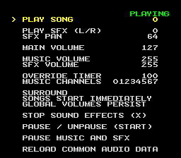

Terrific Audio Driver ca65 API
==============================

Safety
======

The Terrific Audio Driver can deadlock if:

 * `Tad_Init` is called more than once.
 * A `Tad_*` subroutine is called inside an Interrupt Service Routine.
 * A `Tad_*` subroutine is called by multiple threads.
 * A private variable is modified outside of `tad-audio.s`
 * The APUIO registers are written to outside of `tad-audio.s`.


Using Terrific Audio Driver in a ca65 Project
=============================================

Compiling tad-audio.s
---------------------

There are two ways to compile `tad-audio.s`:

1. Update your build system to compile `tad-audio.s` and add it to the linker.
   You will need to declare a `HIROM` or `LOROM` symbol using the ca65 command line
   (ie, `ca65 -DLOROM tad-audio.s -o obj/tad-audio.o`)

2. Create a new source file that declares the memory map symbol, optional segment defines and
   includes `tad-audio.s`.  See the `DEFINES` section of `tad-audio.s` for more information.

   NOTE: You SHOULD NOT export or modify the `tad-audio.s` variables.

``` asm
   LOROM = 1                                ; Can also be HIROM
   .define TAD_CODE_SEGMENT "CODE1"         ; Optional, defaults to "CODE"
   .define TAD_PROCESS_SEGMENT "CODE3"      ; Optional, defaults to TAD_CODE_SEGMENT

   .include "../terrific-audio-driver/audio-driver/ca65-api/tad-audio.s"
```


Embedding Audio Data
--------------------

There are two ways to embed audio data into a ROM:

1. Automatically using `tad-compiler ca65-export`.
   `tad-compiler ca65-export` will output:
    * a binary file that contains the audio-driver, common-audio data and song data.
    * an assembly file containing `.incbin` statements and a `LoadAudioData` subroutine.
    * an (optional) `.inc` file containing Song and SFX enums.
   See [sound-test](tests/sound-test) for an example.

2. Manually, by creating an assembly file that:
   * Embeds and exports the audio driver binaries.
     See the `External Resources` section of [tad-audio.inc](tad-audio.inc) for more details.
   * Exports a `LoadAudioData` far subroutine.
     See the `CALLBACKS` section of [tad-audio.inc](tad-audio.inc) for more details.
      * The common-audio data can be compiled with the `tad-compiler common` command.
      * The song data can be compiled with the `tad-compiler song` command.
      * IMPORTANT NOTE: `tad-compiler song` does not test if the song can fit in Audio-RAM and
        there is no bounds checking in the loader.<br/>
        Please use the `tad-compiler check` command or `tad-gui` to verify the song data fits in
        Audio-RAM.
   * The `tad-compiler ca65-enums` command can create an `.inc` file containing the Song and SFX enums.
   * See the `Binary Data` and `Dummy Audio Data` sections of
     [tad-tests.s](tests/api-tests/src/tad-tests.s) for an example.


Build Requirements
==================
 * [ca65](https://github.com/cc65/cc65/)

To compile the tests, you also need:
 * wiz (included a git submodule, see the parent README for more details)
 * GNU Make
 * Python 3.9+


Testing
=======

Sound Test
----------



1. Build the compiler
   (required if building from source,
   [see the parent README for more information](../../README.md#build-instructions))
2. Switch to the `sound-test` directory (`cd audio-driver/ca65-api/tests/sound-test`)
3. Run `make`


You can customize the `.terrificaudio` project file used by the sound-test with the `TAD_PROJECT`
make variable:

    make clean
    make TAD_PROJECT=<file>


API Tests
---------

1. Build the audio driver (if building from source)
    * `cd audio-driver`
    * `make`
2. Switch to the `api-tests` directory (`cd ca65-api/tests/api-tests`)
3. Run `make`
4. Run `ca65-unit-tests-lorom.sfc` and `ca65-unit-tests-hirom.sfc`


## Test Output
 * Yellow: Tests running
 * Green: Tests pass
 * Red: Test failed or crash

NOTE: The tests test how the loader handles to delays and interrupts and requires ~20 seconds to run.

CAUTION: This test can fail if it running in an emulator and the S-CPU is overclocked.  To make the
tests pass with an overclocked S-CPU, delays will need to be added to `_Wait`, `_WaitForLoader` and
`__CountTransfers` subroutines.

If the loader is modified, the memory accesses must also be verified.
 * Run the test in Mesen
 * Open Mesen's Memory Viewer
 * Restart the test
 * Use the Memory Viewer to verify the following ROM memory regions are read in their entirety:
    * `DummyCommonAudioData_Part1..=DummyCommonAudioData_Part1End`
    * `DummyCommonAudioData_Part2..=DummyCommonAudioData_Part2End`
    * `DummySongData_Part1..=DummySongData_Part1End`
    * `DummySongData_Part2..=DummySongData_Part2End`
 * Use the Memory Viewer to verify the DummyCommonAudioData and DummySongData are correctly loaded
   into Audio-RAM.

See `Dummy Audio Data` section of `tad-tests.s` for more information.


