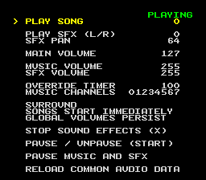

Terrific Audio Driver PVSnesLib API
===================================

Safety
======

The Terrific Audio Driver can deadlock or crash if:

 * `tad_init()` is called more than once.
 * A `tad_*` function is called inside an Interrupt Service Routine.
 * A `tad_*` function is called by multiple threads.
 * A private tad function (not declared in `tad-audio.h`) is called.
 * A variable is modified outside of `tad-audio.asm`.
 * The APUIO registers are written to outside of `tad-audio.asm`.

Please read the documentation in [tad-audio.h](tad-audio.h) for more details.

Using Terrific Audio Driver in a PvSnesLib Project
==================================================

Please follow the instructions in the [tad-audio.h](tad-audio.h) documentation.

Build Requirements
==================
 * [PVSnesLib](https://github.com/alekmaul/pvsneslib/) version 4.1.0 or later
 * PVSnesLib dependencies, see the [PVSnesLib wiki](https://github.com/alekmaul/pvsneslib/wiki/Installation) for more information

Testing
=======

Sound Test
----------

1. Build tad-compiler if building from source,
   [see the parent README for more information](../../README.md#build-instructions).
2. Switch to the `sound-test` directory
3. Run `make`
    * If `make` fails with a "PVSNESLIB_HOME is not defined." error message,
      you will need to define a `PVSNESLIB_HOME` environment variable.
      See the [PVSnesLib wiki](https://github.com/alekmaul/pvsneslib/wiki/Installation) for more information.

You can customize the `.terrificaudio` project file used by the sound-test with the `TAD_PROJECT`
make variable:

    make clean
    make TAD_PROJECT=<file>

API Tests
---------

1. Build the audio driver (if building from source)
    * `cd audio-driver`
    * `make`
2. Switch to the `api-tests` directory (`cd pvsneslib-api/api-tests`)
3. Run `make`
    * If `make` fails with a "PVSNESLIB_HOME is not defined." error message,
      you will need to define a `PVSNESLIB_HOME` environment variable.
      See the [PVSnesLib wiki](https://github.com/alekmaul/pvsneslib/wiki/Installation) for more information.
4. Run `pv-unit-tests.sfc`

## Test Output
 * Yellow: Tests running
 * Green: Tests pass
 * Red: Test failed

NOTE: The tests requires ~10 seconds to run.

CAUTION: This test can fail if it is running on an emulator and the S-CPU is overclocked.

If the loader is modified, the memory accesses must also be verified.  The procedure is the same as
the ca65 API tests.  Check the [ca65-api README](../ca65-api/README.md#api-tests) for details.

