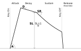

Instruments
===========
 * **Source**: A `.wav` or `.brr` file
 * **Frequency**: The frequency of the sample when played at a sample-rate of 32000 Hz
 * **Loop**: Determines how the sample is looped (see *Loop Options* below)
 * **First octave**: The first octave (0-7) that can be played with the instrument
 * **Last octave**: The last octave (0-7) that can be played with the instrument
 * **Envelope**: The default envelope for the sample (see *Envelopes* section below)
 * **Comment**: A small comment you can add to the instrument

Samples
=======
Samples do not play notes or octaves.
Instead, the user supplies a list of sample rates that the sample can be played at.

Samples are treated exactly the same as instruments in MML and bytecode assembly.
The first sample-rate is Note 0, the second sample-rate is Note 1, etc.

 * **Source**: A `.wav` or `.brr` file
 * **Loop**: Determines how the sample is looped (see *Loop Options* below)
 * **Sample Rates**: A list of sample rates that the sample source can be played at
 * **Envelope**: The default envelope for the sample (see *Envelopes* section below)
 * **Comment**: A small comment you can add to the sample

Source
======

The terrific audio driver can load instruments and samples from either `.brr` files of 16-bit mono `.wav` files.

BRR Files
---------
`.brr` files are raw BRR files may contain an optional two byte loop-point header.  The file size is
used to determine if the loop-point header exists or not.

If the `.brr` file has the loop-flag set but does not have a loop-point header, the loop point
(multiple of 16) must be manually set.

If the loop-point header exists, it can be overridden.

Wave Files
----------

The compiler will only accept mono 16-bit uncompressed .wav files.  Cutting, retuning or editing
sample files is beyond the scope of the program.

 * WAVE files must be a multiple of 16 samples in size.
 * The loop point must be a multiple of 16 samples.
 * The sample should start at 0 amplitude.
 * Looping samples should be short.
 * Looping sample WAVE files should loop perfectly to prevent clicking, popping or buzzing.
   This can be achieved by tuning the sample (in a digital audio editor) so its wavelength is a multiple of 16.
   Example tuning frequencies include (when played back at 32000Hz):
     * 2000 Hz (16 wavelength)
     * 1000 Hz (32 wavelength)
     * 666.6 Hz (48 wavelength)
     * 500 Hz (64 wavelength)
     * 400 Hz (80 wavelength)
     * 333.3 Hz (96 wavelength)
     * 250 Hz (128 wavelength)

### Loop Options
 * None:  The sample will not loop.
 * Loop With Filter:  The sample at the given sample point (multiple of 16).  The BRR filter
   is not reset at the loop point.  The sample might not loop perfectly, causing either
   low-frequency noise or glitches.
 * Loop Resets Filter:  The sample loops at the given sample point (multiple of 16).  The BRR filter
   is reset at the loop point.  The sample will loop perfectly, but the block after the loop point
   might have noise.
 * Dupe Block Hack:  Duplicates `N` blocks to the end of the sample in an attempt to increase the
   quality of the first-looping BRR block.
    * This increases the sample size by 9 bytes per block.
    * The filter will not be reset at the loop point.
    * Most samples created with this hack will not loop perfectly, which can add low-frequency
      oscillation or noise to the sample.
    * This option may create a glitched sample, hence the name dupe block hack.

Sample Frequency
================

This is the frequency of the instrument when played back at 32000Hz.  It is used to build a pitch
table containing the sample-rate for every note and instrument that can be played.

The pitch table is limited a maximum 256 entries.  To reduce the size of the pitch table, try to
reduce the number of unique *Sample Frequencies* used in a project.

Octaves
=======

These fields will place limits on the octaves an instrument can be played at.

Instruments played at an excessively high octave can have aliasing effects, while instruments played
at an excessively low octave can loose detail and precision.

Limiting an instrument's octave range can also reduce the size of the pitch table.

Envelopes
=========

Adsr
----

The ADSR envelope consists of 4 values, which match the S-DSP `ADSR1` and `ADSR2` registers.

 * Attack Rate (A): The rate of attack phase (0-15)
 * Decay Rate (D): The rate of the decay phase (0-7)
 * Sustain Level (SL): The decay-sustain transition point (0-7)
    * The DSP will advance to the sustain phase when the decay phase reaches the Sustain Level (`SL+1/8`).
    * If Sustain Level (SL) is 7, the decay phase is skipped
 * Sustain Rate (SR): The rate the sustain phase decays (0-31)
    * If Sustain Rate (SR) is 0, the sustain phase will not decay and the note will play infinitely until keyoff.

The release rate after keyoff is fixed.

Gain
----

The GAIN envelope disables ADSR and writes a 8-bit value to the S-DSP `GAIN` register.

This feature is incomplete and currently unimplemented.  To play a sample without an ADSR envelope
at a fixed envelope volume, use a GAIN value <= 127.

