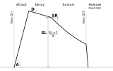

Samples
=======

Sample Section
==============

Samples are sourced from 8/16-bit mono `.wav` files or `.brr` files.

A single `.wav` and `.brr` file can be dragged + dropped into the Samples list
(**not** the samples editor) to create new TAD samples.

Wave Files
----------

The compiler will only accept mono 8 or 16 bit uncompressed `.wav` files.
Cutting, returning or editing sample files is beyond the scope of the program.

 * WAVE files must be a multiple of 16 samples in size.
 * The loop point must be a multiple of 16 samples.
 * The sample should start at 0 amplitude.
 * Looping samples should be short.
 * Looping sample WAVE files should loop perfectly to prevent clicking, popping
   or buzzing.  This can be achieved by tuning the sample (in a digital audio
   editor) so its wavelength is a multiple of 16.  
   Example tuning frequencies include (when played back at 32000Hz):
     * 2000 Hz (16 wavelength)
     * 1000 Hz (32 wavelength)
     * 666.6 Hz (48 wavelength)
     * 500 Hz (64 wavelength)
     * 400 Hz (80 wavelength)
     * 333.3 Hz (96 wavelength)
     * 250 Hz (128 wavelength)

Loop Options:

 * **Loop point**: The loop point in samples (must be a multiple of 16).
 * **Loop filter**: The BRR filter to use at loop point.
    * Reset:  The BRR filter is reset to 0 at the loop point,
      ensuring the sample loops perfectly.
    * Auto:  The best BRR filter at the loop point is used.
       * The last BRR block is not tested when determining the loop point BRR filter.
       * The sample might not loop perfectly, causing either low-frequency noise
         or glitches.
    * BRR Filter 1/2/3:  Force the BRR filter at the loop point.
       * This allows the user to override the BRR filter at the loop point,
         which might create a better sounding sample.
       * The sample might not loop perfectly, causing either low-frequency noise
         or glitches.
 * **Dupe block hack**: Duplicates `N` blocks to the end of the sample in an
   attempt to improve the quality of the looping BRR block.
    * This increases the sample size by 9 bytes per block.
    * Cannot be used with the "Reset filter" loop filter.
    * Most samples created with this hack will not loop perfectly, which can add
      low-frequency oscillation or noise to the sample.
    * This option may create a glitched sample, hence the name dupe block hack.

Encoder settings:

 * **Evaluator**: The evaluator to use when scoring BRR filters and nibbles.
 * **Ignore Gaussian overflow**: Allow glitched Gaussian overflow samples.

   Samples that contain 3 maximum-negative values in a row can overflow the
   Gaussian interpolator and create a loud pop.  TAD normally forbids these
   samples but the overflow test can be ignored for glitch samples that
   intentionally exploit the overflow.

BRR Files
---------

`.brr` files are raw BRR files with an optional two byte loop-point header.
The file size is used to determine if the loop-point header exists or not.

If the `.brr` file has the loop-flag set and does not have a loop-point header,
the loop point (in samples) must be manually set.

If the loop-point header exists, it can be overridden.

Pitches
=======

In TAD, the `VxPITCH` values (speed to play the BRR sample at) are
pre-calculated and stored in a pitch table inside the common-audio-data.

TAD supports BRR samples that play notes or sample-rates.

The samples tab includes a test sample widget that can play notes and
sample-rates to confirm the sample is tuned correctly.

Octaves/Notes
-------------

These settings are for samples that play notes or octaves.

The sample needs to be tuned to calculate the `VxPITCH` values for the range of
octaves/notes used by the sample.

The tuning frequency is the frequency of the instrument when played back at
32000Hz.  It is used to build a pitch table containing the `VxPITCH` values for
every note in the octave/note range.

The samples tab includes a spectrum analyser to assist in selecting the correct
tuning frequency.
 * Clicking on the "Use" button will apply the tuning to the sample.
 * Hovering the mouse will update the "Cursor" and "Cursor Peak" values.
   Clicking the mouse will freeze the values.

### Range

These fields will place limits on the octaves or notes a sample can play.

Samples played with excessively high note can have aliasing effects, while
samples played at an excessively low note can loose detail and precision.

Some tuning frequencies cannot play all possible notes:
 * Tuning frequencies < 988Hz cannot play octave 7
 * Tuning frequencies > 4186Hz cannot play octave 0

Limiting the octave/note range can also reduce the size of the pitch table.

Sample Rates
------------

This setting is intended for samples that are played at a specific sample rate
(for example: vocal samples, recorded SFX, etc).

Instead of tuning the sample, the user supplies a white-space separated list of
sample-rates that the sample is played at.

The first sample-rate is Note 0, the second sample-rate is Note 1, etc.

Envelopes
=========

Adsr
----

The ADSR envelope consists of 4 values, which match the S-DSP `ADSR1` and `ADSR2` registers.

 * Attack Rate (A): The rate of attack phase (0-15)
 * Decay Rate (D): The rate of the decay phase (0-7)
 * Sustain Level (SL): The decay-sustain transition point (0-7)
    * The DSP will advance to the sustain phase when the decay phase reaches the Sustain Level (`(SL+1)/8`).
    * If Sustain Level (SL) is 7, the decay phase is skipped
 * Sustain Rate (SR): The rate the sustain phase decays (0-31)
    * If Sustain Rate (SR) is 0, the sustain phase will not decay and the note will play infinitely until keyoff.

The release rate after keyoff is fixed.

Gain
----

The GAIN envelope disables ADSR and writes a 8-bit value to the S-DSP `GAIN`
register.

 * `<u8>` (no prefix) - the raw 8 bit value to write to the GAIN register
 * `F<value>` - fixed envelope (0-128)
 * `D<rate>` - linear decrease envelope (0-31)
 * `E<rate>` - exponential decrease envelope (0-31)
 * `I<rate>` - linear increase envelope (0-31)
 * `B<rate>` - bent increase envelope (0-31)
